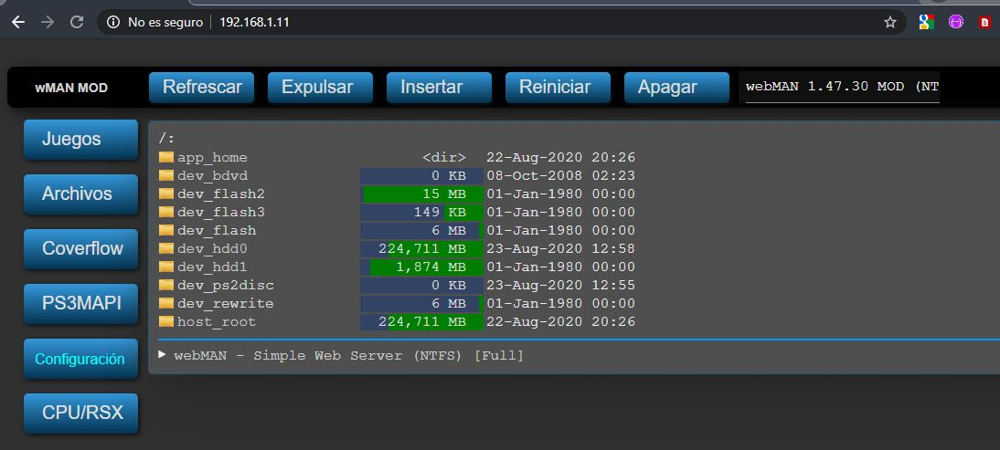

# SingStar en PS3 con discos de PS2

Indicaciones para ejecutar en una PS3 un juego PS3 SingStar ISO (BACKUP) con juegos PS2 SingStar ISO (BACKUP)

## Requisitos
- PS3 ( con HEN y WebMAN ) 
- Juego de SingStar en PS3 (ISO)
- Juego de SingStar en PS2 (ISO): Descomprimido y renombrando cada fichero a MAYUSCULAS
- Cualquier Juego Original de PS2 ( es obligatorio para que funcione )

### Equipo PS3
La PS3 donde fueron realizadas las pruebas tiene las siguientes caracteristicas:
- PS3 con firmware 4.86 
- Con HEN NO OFICIAL HardwareHibrido con 4.86 HFW
- webMAN 1.47.30 MOD

## Procedimiento y pasos a seguir

### Paso 0
- Instalar webMAN 1.47.30 MOD y verificar en que IP se ha instalado **(SELECT+START)**
- Ejecutar desde el navegador del PC con la IP obtenida. En este caso usaremos como ejemplo: **192.168.1.11**

### Paso 1
- Copiamos los discos de PS2 (ISO) descomprimidos y renombrados a MAYUSCULAS cada FICHERO usando **FILEZILLA** al disco duro de la PS3 en la siguiente ruta: '/dev_hdd0/PS2ISO/SingStar/'. Lo mejor es copiartodo los ficheros dentro de una carpeta. Supongamos que tenemos la iso de PS2 de Mecano. Creamos una carpeta Mecano y copiamos todo el contenido descomprimido en ese directorio.

- NOTA: es importante que este **Descomprimido y en MAYUSCULAS**

### Paso 2
- Ejecutar juego SingStar PS3 (ISO) 

### Paso 3
- Buscar en el juego de SINGSTAR la opción **cambiar de Disco** (Presionando **SELECT** expulsa el disco)

### Paso 4
- Desde el navegador, montamos virtualmente el SingStar de PS2 (ISO) en este caso Mecano ejecutando la siguiente URL

http://192.168.1.11/mount_ps2/dev_hdd0/PS2ISO/SingStar/Mecano

- Si se ejecuta con exito, veremos un mensaje sobre que esta montado el Disco de PS2 (ISO) 

- Ahora introduce el disco de PS2 Original (cualquier juego no importa si es SingStar)

- Una vez que se introduce, carga el disco

- y al fin funciona!... 

### Paso 5
- Se puede cambiar de disco nuevamente desde el juego:
- Tan sencillo como volver a montar otro disco PS2 con el juego SingStar deseado y repetir los pasos del 3 al 5. 
Por ejemplo: http://192.168.1.11/mount_ps2/dev_hdd0/PS2ISO/SingStar/Clasicos

